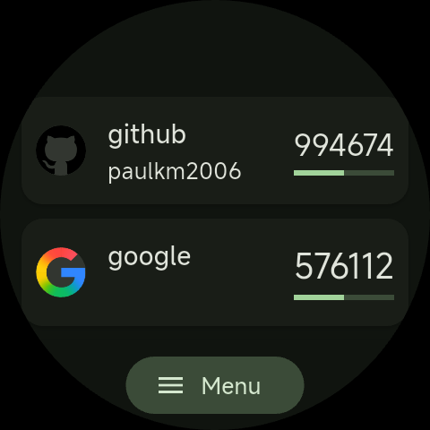
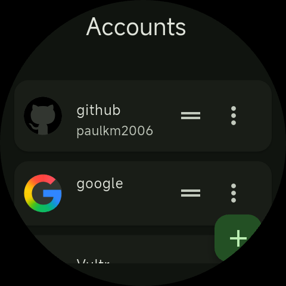
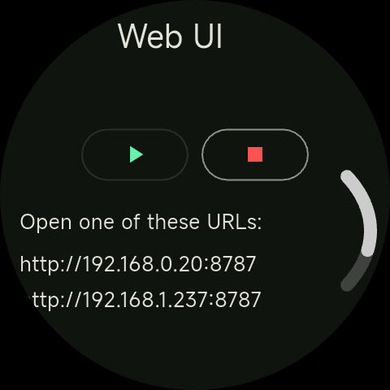
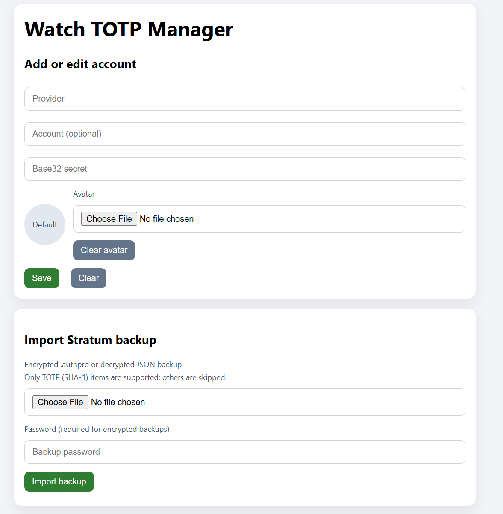

# Watch TOTP

Watch-friendly TOTP generator with a lightweight web UI for managing accounts.

## Features

- TOTP codes with progress indicator optimized for wearable screens
- Account management (add, edit, delete, reorder)
- Optional web UI for easier typing and bulk changes
- Stratum backup import (TOTP SHA-1 entries only)
- Secure local storage on device

## Requirements

- Flutter SDK
- Dart SDK 3.10.x (see [pubspec.yaml](pubspec.yaml))
- Wear OS device or emulator for the primary UI

## Getting started

```bash
flutter pub get
```

Run on a device or emulator:

```bash
flutter run
```

## Using the app

1. Open the app on your watch.
2. Tap **Menu** to manage accounts.
3. Add a provider and Base32 secret.

The main screen shows the current code and a progress bar for the remaining period.

## Web UI

The web UI runs a small HTTP server on your watch and lets you manage accounts from a phone or desktop on the same LAN.

1. On the watch, open **Menu** → **Web UI**.
2. Tap the **Play** button to start the server.
3. Open one of the displayed URLs in a browser.
4. Keep the watch app open while using the web UI.

### Stratum import

The web UI can import Stratum backups (`.authpro`, `.stratum`, or JSON). Only TOTP (SHA-1) entries are supported; other entry types are skipped.

## Screenshots

| Main codes | Accounts | Web UI | Import |
| --- | --- | --- | --- |
|  |  |  |  |

## Notes

- Secrets are validated as Base32.
- Default TOTP settings: 6 digits, 30-second period.
- Accounts are stored locally using secure storage; no cloud sync is included.
